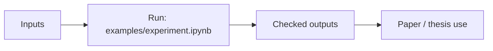

# sm_imputation

Spacematrix imputation experiments and baselines.

## Scheme



## Main Result


## Run

Entrypoint: `examples/experiment.ipynb`

Human:

```bash
pip install -r requirements.txt && jupyter notebook examples/experiment.ipynb
```

Agent:

Compare against simple baselines before adding imputation complexity.

## Publication

See `paper.pdf`.

## Next Steps / Heuristics

Heuristic: keep metrics and visual checks together; do not trust aggregate score alone.
