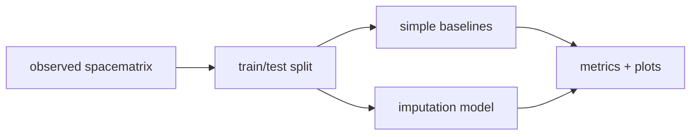

# sm_imputation

[](https://github.com/aimclub/OSA)

Spacematrix imputation experiments: baselines, model checks, and visual diagnostics for filling missing urban morphology values.

## System Map



## Main Result


## Run

Entrypoint: `examples/experiment.ipynb`

Human:

```bash
pip install -r requirements.txt && jupyter notebook examples/experiment.ipynb
```

Agent: compare against simple baselines before adding imputation complexity, and inspect visual diagnostics alongside metrics.

## Publication

See `paper.pdf`.

## Next Steps / Heuristics

Heuristic: aggregate score alone is not enough. Keep metric tables and visual residual checks together.

